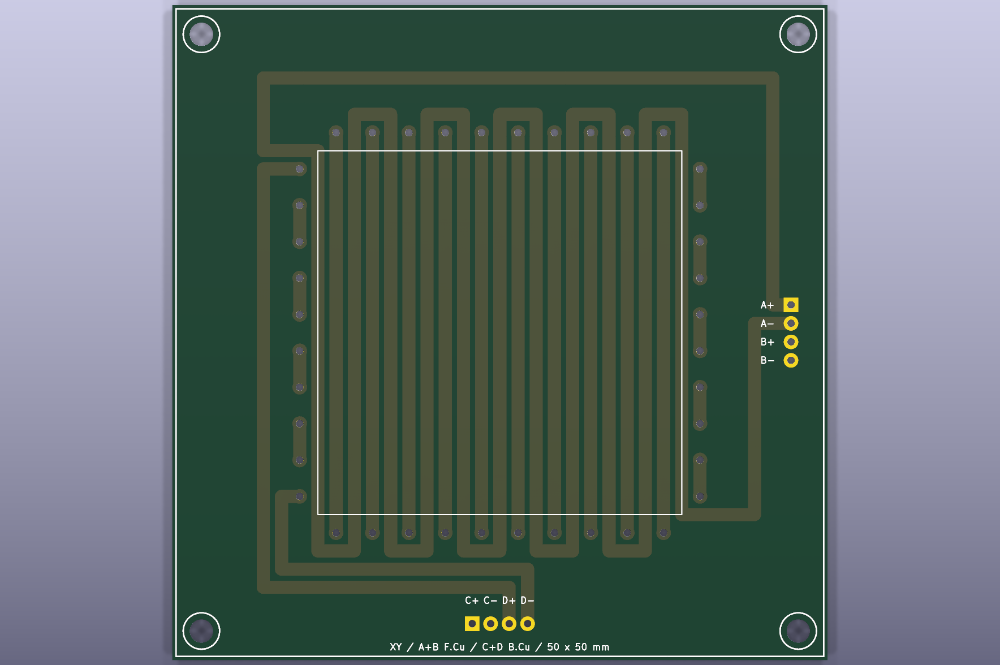

# Planar Stepper Flex

プリント配線をモータ巻線として使うXY平面ステッパの試作一式です。Pico 2 W、秋月電子の`AE-DRV8835-S` 4個、2種類の2層FPCを対象にしています。

> 現在は非公開で検証中です。回路・FPC・ファームウェアはいずれも試作品で、連続電流定格を保証していません。公開前にライセンスを決定します。

## 収録内容

| ディレクトリ | 内容 |
|---|---|
| `hardware/pico2w-drv8835-controller/` | Pico 2 WとDRV8835 4個を載せる制御基板 |
| `hardware/drv8835-driver-module/` | 外部マイコン用DRV8835 4個基板 |
| `hardware/flex-50mm/` | 有効配線領域50 x 50 mmのFPC |
| `hardware/flex-4cards/` | 名刺4枚相当の有効配線領域を持つFPC。手描きシルク入り |
| `firmware/pico2-drv8835/` | USB G-code版、診断版、Pico 2 W Wi-Fi版 |
| `generator/` | 寸法指定可能なFPC生成器と手描きシルク注入処理 |
| `manufacturing/v0.1.0/` | DRC確認済みGerber ZIP、BOM、表裏PNG、ハッシュ |

## 基板プレビュー

| Pico 2 W制御基板 | DRV8835単独基板 |
|---|---|
|  |  |

| 50 mm FPC | 名刺4枚サイズFPC |
|---|---|
|  |  |

背面画像は各`manufacturing/v0.1.0/<board>/back.png`にあります。

## 最短手順

1. [安全上の注意](docs/safety.md)と[配線表](docs/wiring.md)を確認します。
2. VMを切った状態でPicoを起動し、DRV8835入力がLowであることを確認します。
3. 外付け直列抵抗と安定化電源の電流制限を使い、低い電圧・短い励磁から試します。
4. ファームウェアは[ビルド手順](docs/firmware-build.md)に従って生成します。
5. 基板を変更した場合は[製造データ手順](docs/manufacturing.md)でDRCとZIPを再生成します。

FPC生成器の使い方は[基板生成](docs/board-generation.md)、設計元と参考資料は[参考資料](docs/references.md)を参照してください。

## ライセンス

現時点ではライセンスを付与していません。公開・再配布・製造利用の前に[権利と公開状態](RIGHTS.md)および[公開前チェックリスト](PUBLIC_RELEASE_CHECKLIST.md)を確認してください。
