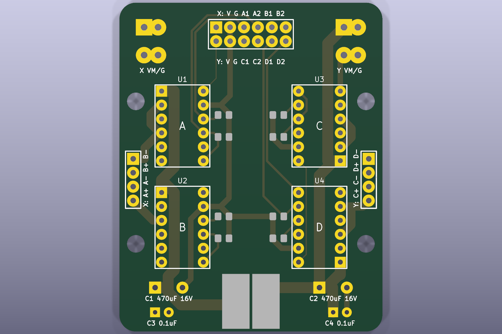
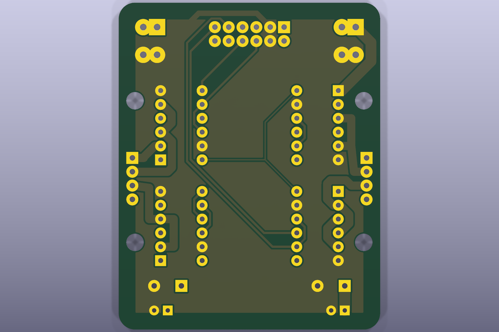

# AE-DRV8835-S単独ドライバ基板

外部マイコンからA/B/C/D相を制御する、`AE-DRV8835-S` 4個の2層基板です。

- 外形: 48 x 60 mm、角R3 mm
- 入力J1: 上段X=`VCC GND A1 A2 B1 B2`、下段Y=`VCC GND C1 C2 D1 D2`
- X出力J4: `A+ / A- / B+ / B-`
- Y出力J5: `C+ / C- / D+ / D-`
- 固定穴: φ3.2 mm NPTH 4個

入力`A1/A2`などはモータ出力名ではなく、対応する相モジュールの`IN1/IN2`です。各入力には10 kohmプルダウンがあります。VM_X/VM_Yは通常分離し、共通化する場合はVMはんだジャンパを両方閉じます。

製造ZIP、BOM、DRCレポートは[`../../manufacturing/v0.1.0/drv8835-driver-module/`](../../manufacturing/v0.1.0/drv8835-driver-module/)にあります。
