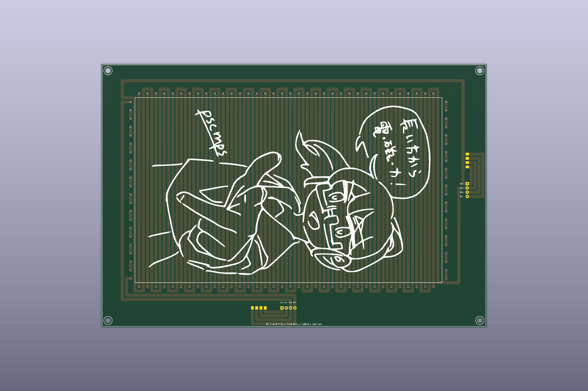
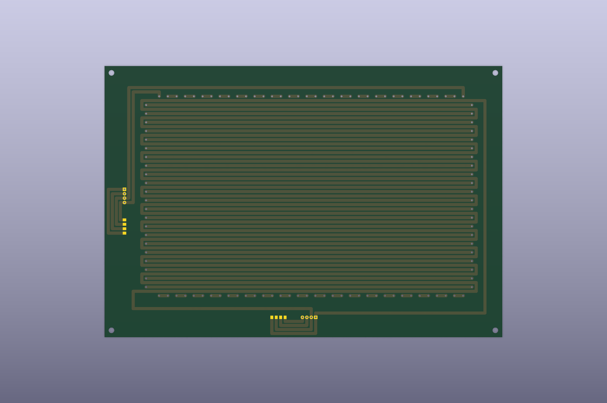

# 名刺4枚サイズXY平面ステッパーFPC

標準名刺91 x 55 mmを2 x 2で並べた範囲を有効配線領域とする大型2層FPCです。

- 外形: 229.0 x 156.5 mm
- 有効配線領域: 182.5 x 110.0 mm
- ピッチ: 5.0 mm
- B/D相オフセット: 2.5 mm
- 配線幅: 1.8 mm
- 補助SMD端子: 表裏に各4極、既存PTH列から長手方向へ10 mm離して配置
- 手描きシルク: 生成時に`generator/assets/hand-drawn-silkscreen.kicad_mod`から追加

概算配線長と抵抗はA=4967.5 mm/1.359 ohm、B=4665.1 mm/1.277 ohm、C=4887.5 mm/1.337 ohm、D=4577.6 mm/1.253 ohmです。銅厚35 um、銅抵抗率1.724e-8 ohm mによる一次概算です。

このPCBは直接編集せず、[`../../docs/board-generation.md`](../../docs/board-generation.md)の`--preset 4cards --with-art`で再生成します。製造ZIPは[`../../manufacturing/v0.1.0/flex-4cards/`](../../manufacturing/v0.1.0/flex-4cards/)にあります。
