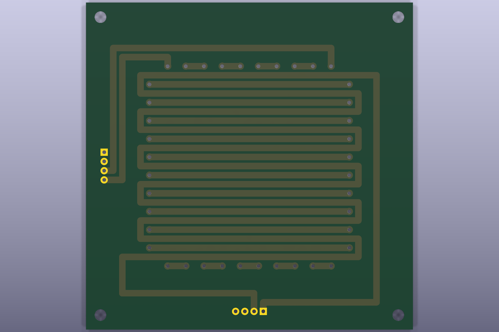

# 50 mm XY平面ステッパーFPC

有効配線領域50 x 50 mmの2層FPCです。A/B相とC/D相を5 mmピッチ、2.5 mmオフセットで交互配置します。

このPCBは直接編集せず、[`../../docs/board-generation.md`](../../docs/board-generation.md)の`--preset 50mm`で再生成します。製造ZIPは[`../../manufacturing/v0.1.0/flex-50mm/`](../../manufacturing/v0.1.0/flex-50mm/)にあります。
