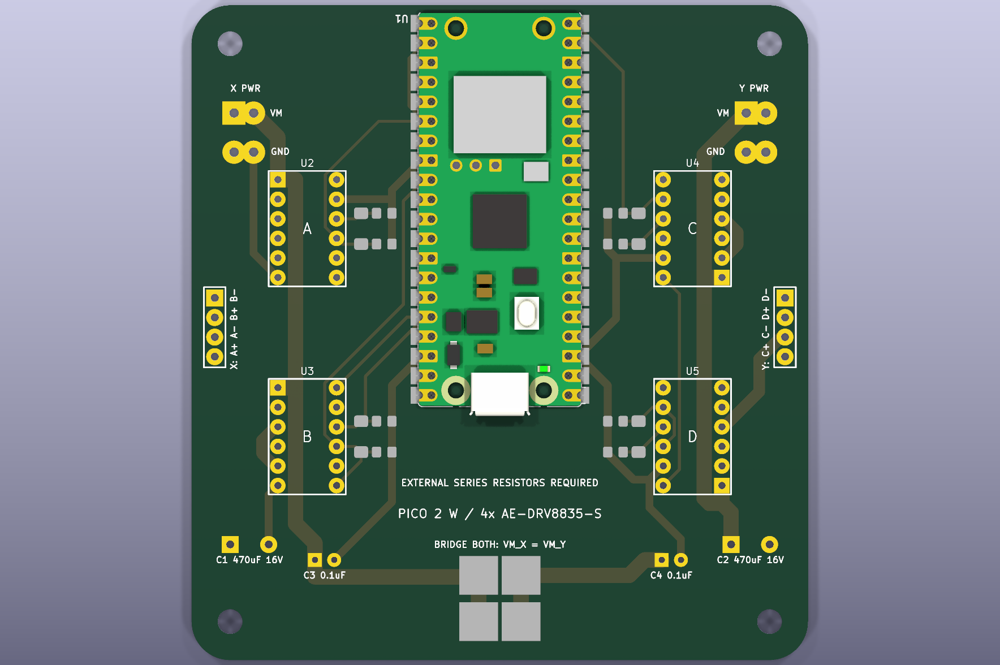
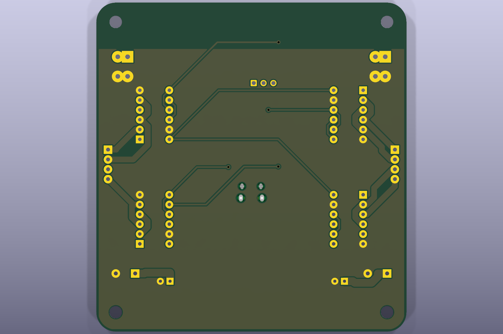

# Pico 2 W + AE-DRV8835-S制御基板

Pico 2 Wと`AE-DRV8835-S` 4個を載せ、A/B/C/D相を個別駆動する2層基板です。

- 外形: 80 x 85 mm、角R5 mm
- 相配線: 1.5 mm
- VM配線: 2.0 mm、X/Y別系統
- モジュール: 2.54 mm、列間7.62 mm、1相につき1個
- X出力: `A+ / A- / B+ / B-`
- Y出力: `C+ / C- / D+ / D-`

GPIO、AS5600、サーボ、将来microSDの割当は[`../../docs/wiring.md`](../../docs/wiring.md)を参照してください。VM_X/VM_Yを共通化する場合は両方のVMはんだジャンパを閉じ、電源入力は片側だけを使います。

製造ZIP、BOM、DRCレポートは[`../../manufacturing/v0.1.0/pico2w-drv8835-controller/`](../../manufacturing/v0.1.0/pico2w-drv8835-controller/)にあります。
